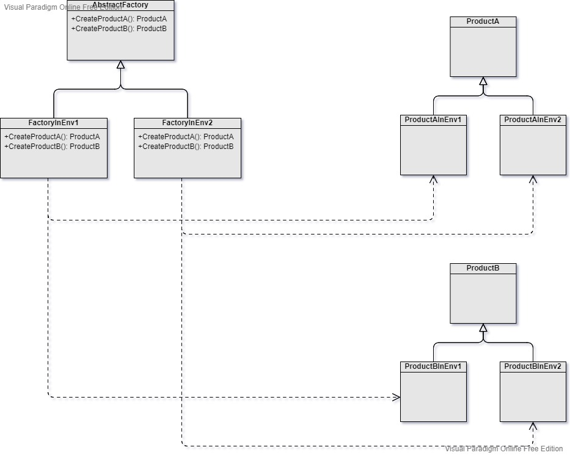

Abstract Factory
===
Scenario: To create objects in different environments.

Pattern: There's one individual factory that exists in each environment. Each factory creates the concrete product in a specific environment.

Examples: Customizes system UI elements under different themes. For example, to create popup, menu, banner in default mode, festival mode, sad mode, etc.

