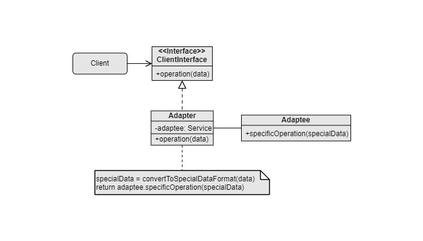

Adapter
===
Catalog: Structural design pattern

Scenarios: The interfaces of objects are incompatible. There may be potential extension of the object types in the future.

Examples: Use data table to XML and data table to JSON conversion libraries whose interfaces are incompatible.

