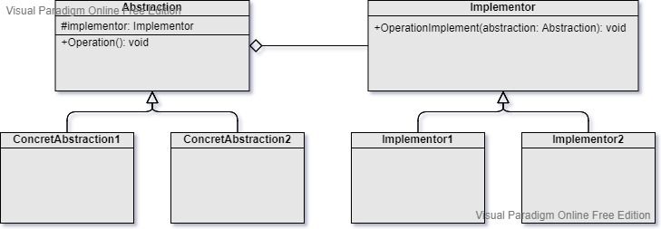

Bridge
===
Catalog: Structural design pattern

Scenarios: A set of closely related classes grow exponentially or a complex class grows dramatically as the abstractions or implementations which can be developed independently are extended. With the Bridge design pattern, we can split the abstractions and implementations and let them be selected at run-time.

Explaination of abstraction and implementation:
- Abstraction: The high-level control layer without doing any real work, it delegates the work to the implementation layer.
- Implementation: The layer with real work. It's also called the *platform*.

Examples: The GUI and the operating system APIs of an app. The GUI calls the operation system APIs in response to user interactions.

