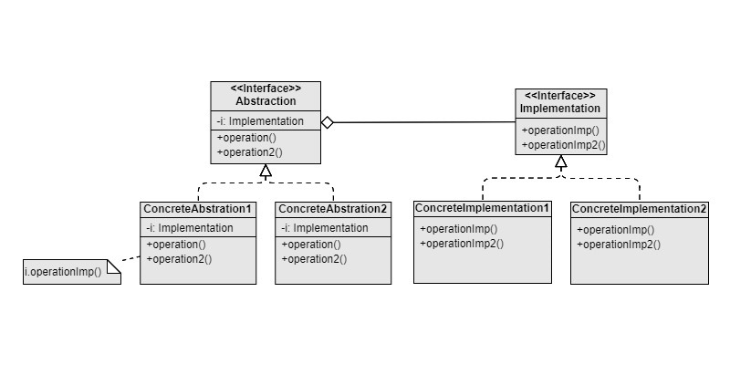

Bridge
===
Scenario: When there exists two groups of objects. Objects in group A use objects in group B. The usage lines are very complicated.

Pattern: There are two inheritance trees. One for group A, and another for group B. Objects in group A contains a reference to objects in group B.

Example:
- Magic spells that can be learnt or used by different magicians
- Equipable weapons for each character.

