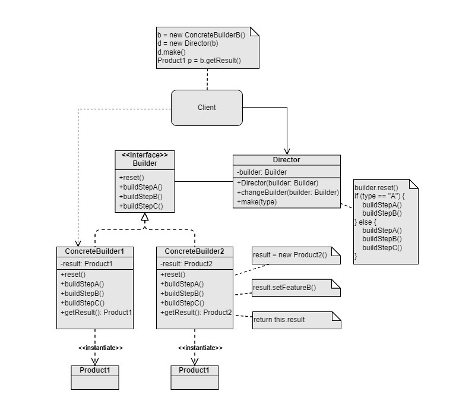

Builder
===
Catalog: Creational design pattern

Scenarios: The constructions of objects are very complicated.

Examples: Construct various types of house objects. Since constructing a house object includes many parts like windows, doors, walls, roofs, floor, etc, this may result in a huge complex construtor, or a constructor with many arguments, in which most of them may be set to `null` when the constructor is called. There may be potential extension of the types of the building method in the future.

