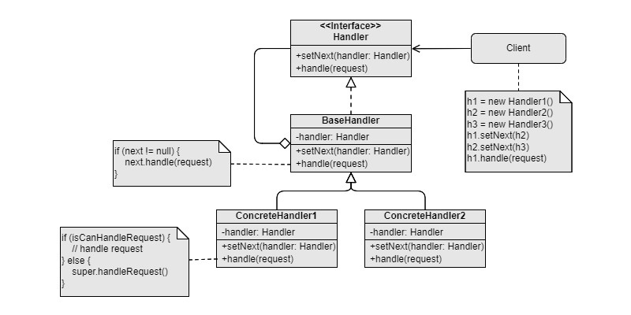

Chain of Responsibility
===
Catelog: Behavioral design pattern

Scenario: A request is conditionally accepted, processed by a sequence of handlers in a specific order. There may be potential extension of the handlers in the future.

Remarks:
- The handler can decide whether to accept the request or not.
- The handler can decide whether to pass the request to next handler or not.
- Unlike state machine design pattern, there is only one request flow in the chain of responsibility design pattern.

Examples: The document signing process in a company. Telecom company customer service process.

