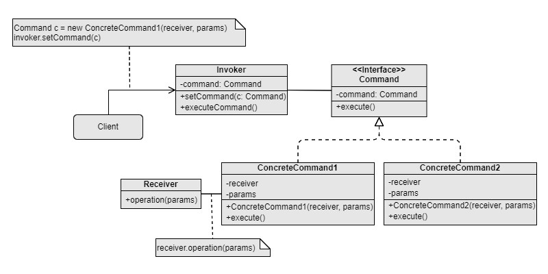

Command
===
Catalog: Behavioral design pattern

Scenarios: To store, delay, queue requests. To allow requests to be undone, ordered, or canceled. There may be potential extension of the types of request in the future.

Examples: History panel feature of modern media editing tools.

