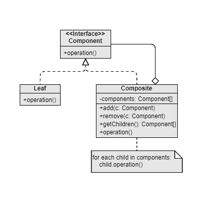

Composite
===

Scenario: When there exists a tree node (root - leaf liked) structure.

Pattern: Both root and leaf inherits the same interface, that is, share the same operations, while only the root nodes contain an array as child nodes.

Remark: To realize customized operations to different types of child nodes, we can adopt “Visitor Design Pattern”.

Examples: File explorer

