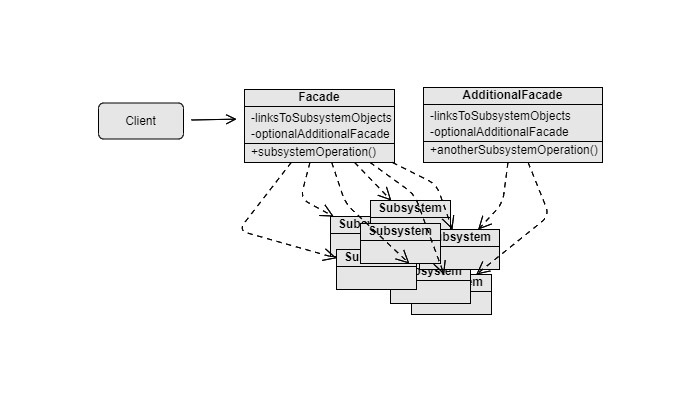

Facade
===
Scenario: The way of using a feature is very complex, then we can use Facade design pattern to provide simplified interface.

Example: Use of a library with complex initialization process, or use of a library with complex functions invocations in specific order, etc.

