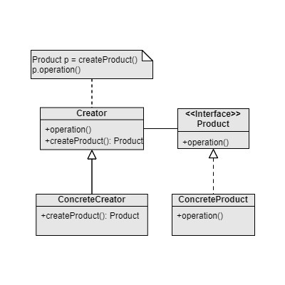

Factory Method
===
Catalog: Creational design pattern

Scenarios: The type of the object to create has to be determined at run-time, the types has same interface, and we want to have the creation being done in sub-classes. There may be potential extension of the types.

Examples: A multi-database supported framework.

