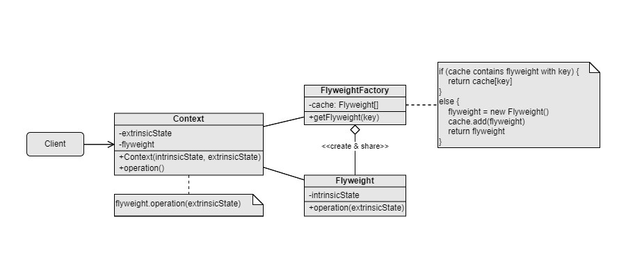

Flyweight
===
Scenario: When many small groups of attributes are immutable and can be shared through objects.

Pattern: There exists a shared version and an unshared version of attributes classes that inherits the same interface. A factory that stores all shared versions of attributes, like an object pool. Client gets a shared version of attributes through the factory. If necessary, clients replace the shared version of attributes with the unshared version, so data can be modified.

Examples:
- A character includes level, health, mana, move speed, weapon, AI….
- Bullet and magic spell object pool

