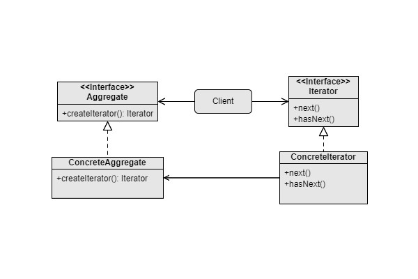

Iterator
===
Catalog: Behavioral design pattern

Scenarios: To traverse through elements of a collection easily.

This pattern is generally already implemented in all popular languages.

Examples: The `for`..`of` loop supported by JavaScript.

