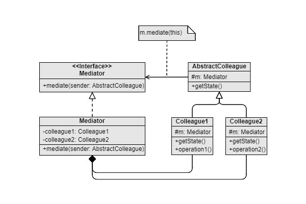

Mediator
===
Scenario: When there are a great amount of subsystems that cooperate with each other, resulting in complex usage lines (how about 100 sub-systems with complex usage lines to each other?). Unlike the facade pattern, the mediator pattern is like a “Controller” in the MVC system model.

Pattern: Groups complex execution order or subsystem interactions into a “mediator” class. Subsystems invoke the APIs provided by the “mediator” class.

Example:
- In a game system, the soldier factory system uses a soldier system, a soldier system uses a resource system, a resource system uses a UI state info system……
- A team in which manager and employees work together. Groups interactions into manager class, and leave detail professional tasks in employee classes

