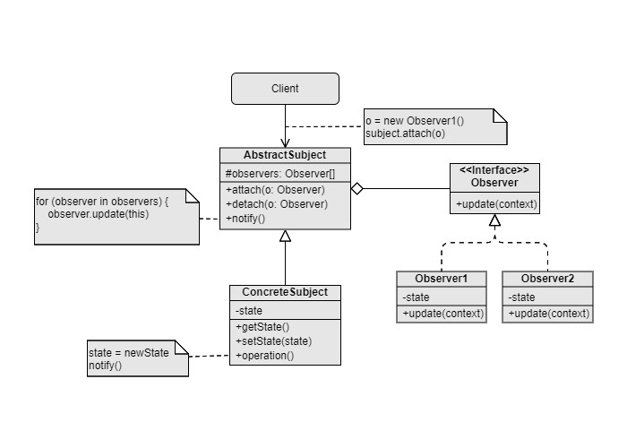

Observer
===
Catalog: Behavioral design pattern

Scenarios: Objects have to be notified (to perform operations) once a certain kind of event occurs in other objects. 

Examples: E-mail subscription.

