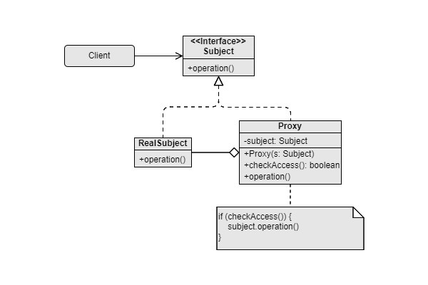

Proxy
===
Catalog: Structural design pattern

Scenarios: To provide placeholder for another object, to conditionally add behavior before or after the execution of another object.

Examples:
- To provide cache feature.
- To show preview low-texture 3D model while the high-texture model is still being loaded, and switch to the high-texture model once it has been fully loaded.

