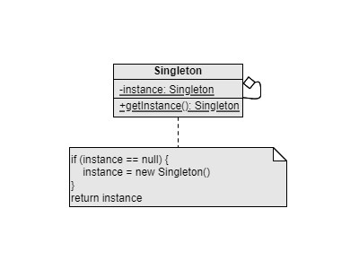

Singleton
===
Catalog: Creational design pattern

Scenario: Only one instance of an class should exist, and provide a global access to it.

Be care of using it, when we use Singleton design pattern, it means we're creating global variables which are unsafe. Usually, this means there is something wrong with our design.

Example: Database connection.

