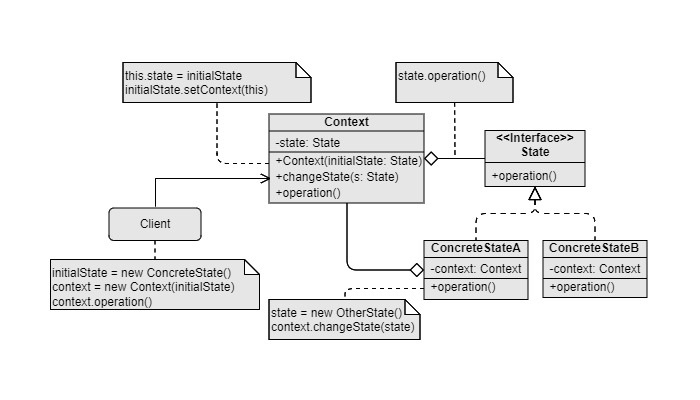

State
===

Catalog: Behavioral design pattern

Scenarios: The behavior of object changes as it's state changes, the number of states is limited, there are certain transitions between the states.

Examples: Behaviors of buttons of the audio player in various states of the audio player.

