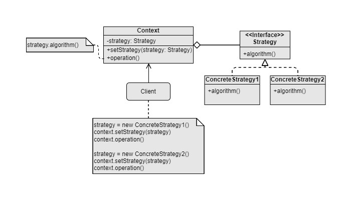

Strategy
===
Catelog: Behavioral design pattern

Scenario: When a family of algorithms need to be interchanged at runtime, or the families can be extended in the future.

Example: Different types of travel route calculation algorithms. For example, walking, driving, public transport.

