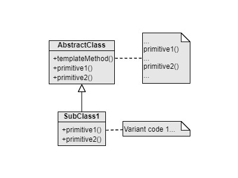

Template Method
===
Catalog: Behavioral design pattern

Scenario: Some portions of an algorithm are different in different scenarios, while the rest are the same. The scenarios could be extended in the future.

Example: Mining a Word, CSV or a PDF file includes 5 steps in order: Open file, load data, parse data, analyze data, send report, and close the file.

