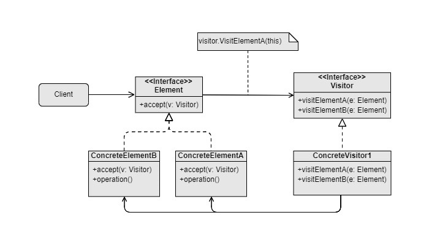

Visitor
===

Catalog: Behavioral design pattern

Scenarios: To separate various types of operations that access a group of objects from them. The types of the operation can be extended in the future without modifying the group of objects to be accessed.

Examples: For equipment in the backpack:
- Gets backpack loading by looping through all types of equipment
- Removes every broken forks from backpack

